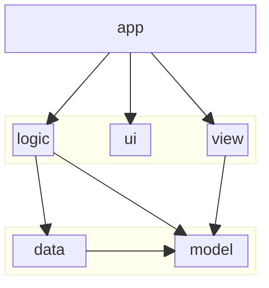

## `src` folder

### Content

| folder  | purpose                      |
| ------- | ---------------------------- |
| `app`   | next.js application          |
| `data`  | data source management layer |
| `logic` | business logic layer         |
| `model` | data model elements          |
| `ui`    | ui components                |
| `view`  | model view layer             |

### Relationships

